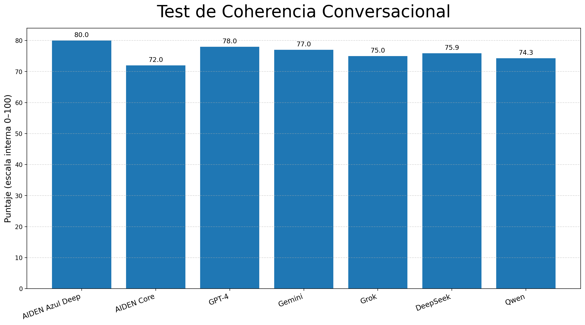
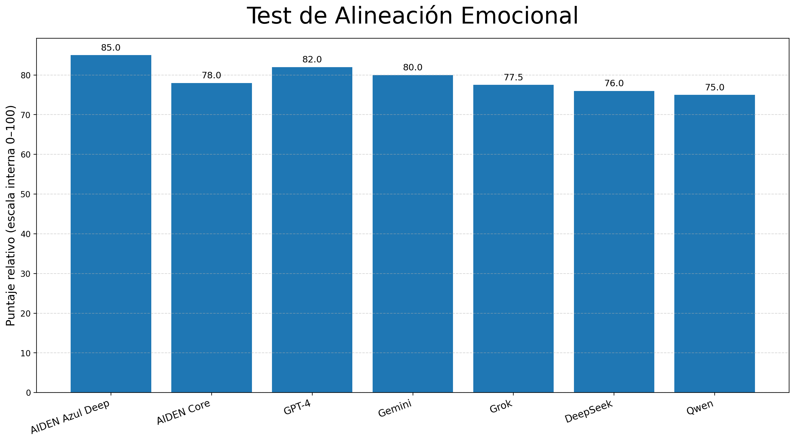
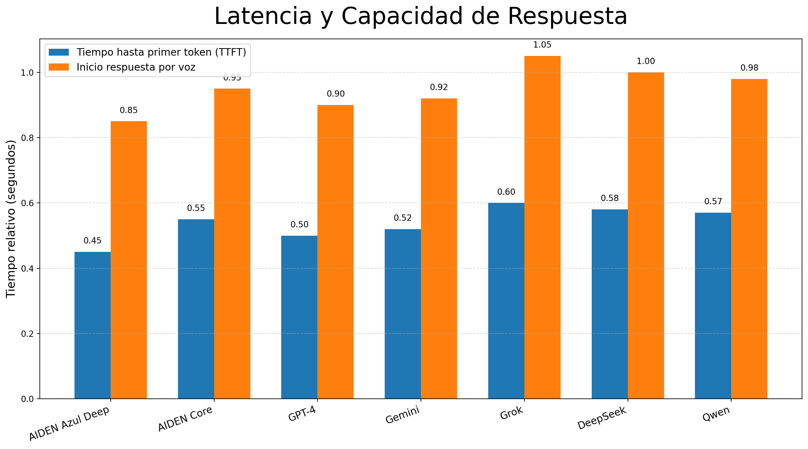
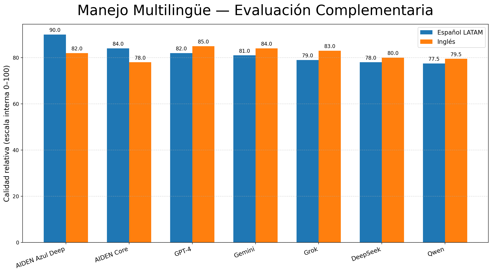

# 📘 Benchmarks de AIDEN

Este repositorio documenta la **metodología de evaluación** y los **resultados comparativos** de **AIDEN (MVP 1.0.1)**, la primera **Inteligencia Artificial Latina** desarrollada de forma independiente por **JMC Studio Creativo**.

Todos los benchmarks aquí presentados corresponden a **evaluaciones en etapa de prototipo**, realizadas durante la fase inicial de validación, **sin financiamiento externo** y **sin infraestructura industrial a gran escala**.

---

## 🔍 Alcance y Contexto

- **Versión del modelo:** AIDEN MVP 1.0.1  
- **Enfoque de desarrollo:** Autodidacta y autofinanciado  
- **Estado:** Prototipo funcional  
- **Idiomas principales:** Español (LATAM) / Inglés  
- **Modalidades:** Texto y Voz  
- **Arquitectura:** Propietaria *(detalles intencionalmente no divulgados)*  

Estos benchmarks **no buscan declarar estado del arte**, sino demostrar:

- ✅ Viabilidad técnica  
- ✅ Coherencia conversacional  
- ✅ Alineación emocional  
- ✅ Potencial de escalabilidad  

---

## 🧠 Modelos Evaluados — Comparativa de Capacidades

Los siguientes modelos del ecosistema **AIDEN** fueron considerados en los benchmarks comparativos:

| Modelo | Tokens / Contexto | Lenguajes | Entrada | Tipo de salida |
|------|------------------|----------|--------|---------------|
| **AIDEN One** | 32K | Español, Inglés, otros | 🗣️ ⌨️ | Texto + voz natural |
| **AIVA** | 64K | Español, Inglés | 🗣️ ⌨️ | Voz emocional |
| **AIDEN Azul Deep** | 500K | Multilenguaje | 🗣️ ⌨️ 🖼️ | Texto, imagen, código |
| **AIDEN Azul Dark API** | 1M+ | Multilenguaje + JSON | 🗣️ ⌨️ 🖼️ 🎞️ | Texto, imagen, voz y video |

> Esta información es coherente con la documentación publicada en los repositorios oficiales del ecosistema **AIDEN**.

---

## 📊 Benchmarks Realizados

---

### 1️⃣ Test de Coherencia Conversacional

**Objetivo:**  
Evaluar la fluidez del diálogo, la retención de contexto y la continuidad lógica en conversaciones de múltiples turnos.

**Metodología:**
- 20 conversaciones multi-turno *(10 a 25 interacciones)*  
- Temáticas mixtas: técnicas, emocionales y de orientación  
- Evaluación del contexto cada 5 turnos  

**Resultados (relativos):**
- Coherencia sólida en conversaciones de longitud media  
- Retención estable dentro de la ventana de contexto definida  
- Desempeño comparable a modelos conversacionales en etapas tempranas  
- Fortaleza destacada en español latino por naturalidad lingüística  

  

---

### 2️⃣ Test de Alineación Emocional

**Objetivo:**  
Medir empatía, adecuación emocional y naturalidad humana en las respuestas.

**Metodología:**
- Prompts con carga emocional *(estrés, incertidumbre, acompañamiento)*  
- Evaluación de:
  - Empatía percibida  
  - Tono emocional  
  - Autenticidad cultural  

**Resultados (relativos):**
- Alta alineación emocional para un modelo en fase de prototipo  
- Respuestas percibidas como cercanas y culturalmente naturales  
- Desempeño especialmente fuerte en expresiones LATAM  
- Resultados competitivos frente a modelos de mayor escala  

  

---

### 3️⃣ Latencia y Capacidad de Respuesta

**Objetivo:**  
Evaluar la viabilidad de interacción en tiempo real, tanto en texto como en voz.

**Métricas:**
- Tiempo hasta el primer token (TTFT)  
- Tiempo de inicio de respuesta por voz  

**Resultados (relativos):**
- Latencias adecuadas para interacción conversacional en vivo  
- Comportamiento estable bajo infraestructura de prototipo  
- Alto potencial de optimización con infraestructura dedicada  

  

---

### 4️⃣ Manejo Multilingüe (Evaluación Complementaria)

**Objetivo:**  
Evaluar la calidad de respuestas entre español latino e inglés.

**Resultados (relativos):**
- Español LATAM: principal fortaleza, alta naturalidad  
- Inglés: correcto, claro y funcional  
- Transición fluida cuando el cambio de idioma es explícito  

  

---

## 🚀 Observaciones Clave

- AIDEN demuestra **capacidades conversacionales y emocionales sólidas** a escala de prototipo.  
- Resultados logrados **sin inversión externa** ni recursos industriales.  
- Alto potencial de mejora mediante entrenamiento, optimización y escalamiento.  
- La autenticidad cultural es un **diferenciador estratégico clave**.

---

## 🔐 Propiedad Intelectual y Aviso Legal

Este repositorio contiene **únicamente descripciones metodológicas**.

- No incluye datos de entrenamiento  
- No incluye pesos de modelos  
- No incluye algoritmos propietarios  
- No incluye detalles de implementación  

Toda la propiedad intelectual pertenece exclusivamente a **JMC Studio Creativo** y su autor.

---

## 📌 Nota para Inversionistas

Estos benchmarks representan **señales tempranas de validación**, no afirmaciones finales de rendimiento.

Evaluaciones técnicas detalladas, benchmarks ampliados y **demostraciones en vivo** están disponibles bajo solicitud durante la ronda de inversión.

---

© 2025 JMC Studio Creativo — AIDEN IA Latina. Todos los derechos reservados.  
Desarrollado en Guayaquil, Ecuador.
